# International Cunnibal

<div align="center">

# 🧠 International Cunnibal

## *Train, Dominate, Savor.*

<p align="center">
  
  
  
  
</p>

<p align="center">
  
  
  
  
</p>

### 🚀 Neural Biofeedback Engine for Precision Oral Biomechanics

*Revolutionary sensory-motor synchronization training powered by Anokhin's Action Acceptor theory*

[🎯 Features](#-features) • [📱 Demo](#-demo) • [🛠️ Quick Start](#-installation) •
[📊 Architecture](#-architecture) • [🧭 Delivery Plan](docs/delivery_plan.md) • [🤝 Contributing](#-contributing)

---

</div>

## 🌟 Overview

**International Cunnibal** is a cutting-edge Flutter application that brings neuroscience to your fingertips.
Built on **Anokhin's Action Acceptor theory**, this sophisticated neural biofeedback system provides real-time
tongue biomechanics tracking and analysis through advanced on-device AI processing.

<div align="center">

### 💡 Why International Cunnibal?

</div>

<table>
<tr>
<td width="33%" align="center">
<br/>
<b>🧠 AI-Powered</b><br/>
Advanced neural engine with Action Acceptor validation
</td>
<td width="33%" align="center">
<br/>
<b>🔒 Privacy First</b><br/>
100% on-device processing, zero cloud dependency
</td>
<td width="33%" align="center">
<br/>
<b>⚡ Real-Time</b><br/>
30 FPS tracking with instant feedback
</td>
</tr>
</table>

## ✨ Features

<div align="center">

### 🎯 Core Capabilities

```mermaid
graph LR
    A[📷 Camera] -->|30 FPS| B[🧠 AI Processing]
    B --> C[📊 Landmarks]
    C --> D[✅ Validation]
    D --> E[📈 Metrics]
```

</div>

<details open>
<summary><b>📸 Bio-Tracking</b> - Real-time Tongue Biomechanics</summary>

<br/>



- ✅ **High-frequency camera tracking** at 30 FPS
- ✅ **MediaPipe/TFLite integration** for landmark detection
- ✅ **Velocity & acceleration** calculations in real-time
- ✅ **Action Acceptor validation** for movement consistency
- ✅ **10-point landmark** detection for precision tracking

</details>

<details open>
<summary><b>📊 Biometric Metrics</b> - Advanced Performance Analytics</summary>

<br/>

| Metric | Description | Range |
|--------|-------------|-------|
| 🎯 **Consistency Score** | Standard deviation-based measurement | 0-100% |
| 🔄 **Frequency Analysis** | Movement frequency tracking | Hz |
| 📐 **Vector PCA** | Principal Component Analysis | PC1, PC2, PC3 |

**Real-time updates** • **Statistical analysis** • **Pattern recognition**

</details>

<details open>
<summary><b>🧭 Facial Endurance Training</b> - Jaw Endurance, Stability, Control</summary>

<br/>

- Optional, consent-based jaw endurance sessions for comfort and control
- On-device aperture tracking with objective, bounded metrics
- Session flow with ready → hold → rest → summary and safety auto-pauses
- No rankings or public comparisons by default

</details>

<details open>
<summary><b>🔤 Symbol Dictation (A-Z)</b> - Rhythmic Synchronization</summary>

<br/>

Partner-led training with **26 unique rhythm patterns** inspired by Morse code:

```text
A: .-    (Short-Long)
B: -...  (Long-Short-Short-Short)
S: ...   (Short-Short-Short)
```

- 🎵 **Real-time synchronization** scoring
- 📈 **Rhythm consistency** analysis
- 🎨 **Interactive symbol** selection interface
- ⏱️ **Timing precision** validation (0.2s short, 0.6s long)

</details>

<details open>
<summary><b>🤝 Partner Mode</b> - Set the Rhythm Together</summary>

<br/>

- 👫 Partner taps out a custom short/long pattern
- 🎯 You mirror the rhythm with tongue movements in real time
- 🔄 Live synchronization and stability scores
- 🔒 100% on-device processing — no uploads, no streaming

</details>

<details open>
<summary><b>🔐 Infrastructure</b> - Privacy-Focused Architecture</summary>

<br/>

<table>
<tr>
<td align="center">🔒</td>
<td><b>On-Device AI</b><br/>All processing happens locally using TFLite</td>
</tr>
<tr>
<td align="center">📤</td>
<td><b>Automated Exports</b><br/>JSON performance logs with timestamps</td>
</tr>
<tr>
<td align="center">📝</td>
<td><b>Session Logging</b><br/>Comprehensive tracking with summaries</td>
</tr>
<tr>
<td align="center">🚫</td>
<td><b>No Cloud</b><br/>Zero external server communication</td>
</tr>
</table>

</details>

---

## 📱 Demo

<div align="center">

### 🎥 App Showcase

<table>
<tr>
<td width="33%" align="center">
<b>🏠 Home Screen</b><br/>
<sub>Feature navigation hub</sub><br/>

</td>
<td width="33%" align="center">
<b>📸 Bio-Tracking</b><br/>
<sub>Real-time camera feed</sub><br/>

</td>
<td width="33%" align="center">
<b>📊 Metrics</b><br/>
<sub>Live analytics dashboard</sub><br/>

</td>
</tr>
</table>

### 🎯 Key User Flows

```mermaid
sequenceDiagram
    participant U as 👤 User
    participant A as 📱 App
    participant C as 📷 Camera
    participant N as 🧠 NeuralEngine

    U->>A: Open App
    A->>U: Show Home Screen
    U->>A: Start Bio-Tracking
    A->>C: Initialize Camera
    C->>N: Stream Frames (30 FPS)
    N->>N: Process & Validate
    N->>A: Send Metrics (1 Hz)
    A->>U: Display Results
```



</div>

---

## 🏗️ Architecture

<div align="center">

### 🎨 System Design


</div>

### 🧠 NeuralEngine Service

**Anokhin's Action Acceptor Implementation** *(Reference: 2025-11-30)*

<table>
<tr>
<td width="25%" align="center">
<b>1️⃣</b><br/>
📥 Accept<br/>
<sub>Sensory Input</sub>
</td>
<td width="25%" align="center">
<b>2️⃣</b><br/>
🔄 Compare<br/>
<sub>Pattern Matching</sub>
</td>
<td width="25%" align="center">
<b>3️⃣</b><br/>
✅ Validate<br/>
<sub>Motor Execution</sub>
</td>
<td width="25%" align="center">
<b>4️⃣</b><br/>
📊 Feedback<br/>
<sub>Real-time Results</sub>
</td>
</tr>
</table>

- 🔄 Processes **afferent (sensory)** input from tongue tracking
- 📊 Compares **actual movements** with expected patterns
- ✅ Validates **motor command** execution
- 💡 Provides **real-time feedback** for sensory-motor learning

### 🛠️ Core Services

<details>
<summary><b>🎬 BioTrackingService</b> - Camera & Detection</summary>

```dart
// Camera integration and biomechanics detection
- 📷 30 FPS camera processing
- 🎯 Landmark detection (10 points)
- 📈 Velocity & acceleration tracking
- 🔄 Real-time streaming to NeuralEngine

```

</details>

<details>
<summary><b>🔤 SymbolDictationService</b> - Pattern Matching</summary>

```dart
// Rhythm pattern matching and synchronization
- 🎵 26 unique A-Z patterns (Morse-inspired)
- ⏱️ Timing validation (0.2s/0.6s)
- 📊 Synchronization scoring (0-100%)
- 📈 Rhythm consistency analysis

```

</details>

<details>
<summary><b>📤 GitHubExportService</b> - Data Export</summary>

```dart
// Performance log generation and export
- 📝 JSON format with timestamps
- 🤖 Auto-export after 100 metrics
- 📊 Summary statistics included
- 💾 Local storage only

```

</details>

### 📦 Data Models

| Model | Purpose | Fields |
|-------|---------|--------|
| 🎯 **TongueData** | Biomechanics tracking | Position, velocity, acceleration, landmarks, validation |
| 📊 **BiometricMetrics** | Performance analytics | Consistency, frequency, PCA variance |
| 🔤 **DictationSession** | Symbol training | Target symbol, timestamps, sync score, rhythm |

---

## 💻 Technical Stack

<div align="center">

<table>
<tr>
<td align="center" width="96">

<br />Flutter 3.0+
</td>
<td align="center" width="96">

<br />TensorFlow Lite
</td>
<td align="center" width="96">

<br />MediaPipe
</td>
<td align="center" width="96">

<br />Dart 3.0+
</td>
<td align="center" width="96">

<br />Android 5.0+
</td>
<td align="center" width="96">

<br />iOS 12+
</td>
</tr>
</table>

| Component | Technology | Purpose |
|-----------|-----------|---------|
| 🎨 **Framework** | Flutter 3.0+ | Cross-platform mobile development |
| 🤖 **AI/ML** | TensorFlow Lite | On-device model inference |
| 👁️ **Vision** | MediaPipe | Landmark detection pipeline |
| 📷 **Camera** | camera package | Real-time video capture |
| 💾 **Storage** | path_provider | Local file management |
| 📊 **Export** | JSON | Performance log format |

</div>

---

## 🚀 Installation

<div align="center">

### Quick Start Guide

</div>

#### 📋 Prerequisites

```bash
# Verify Flutter installation
flutter --version  # Flutter 3.0+

# Verify Dart installation
dart --version     # Dart 3.0+
```

#### 📥 Clone & Setup

```bash
# 1️⃣ Clone the repository
git clone https://github.com/neuron7x/international-cunnibal.git

# 2️⃣ Navigate to project directory
cd international-cunnibal

# 3️⃣ Install dependencies
flutter pub get

# 4️⃣ Run the app
flutter run

# Demo/simulation mode runs by default (no ML models needed)
# Quick logic loops:
# dart run tool/run_demo.dart
# dart run tool/verify_logic.dart
# dart run tool/benchmark_core.dart
```

#### 🎯 Platform-Specific Setup

<details>
<summary><b>🤖 Android</b></summary>

```bash
# Check connected devices
flutter devices

# Run on Android device/emulator
flutter run -d android

# Build APK
flutter build apk --release
```

**Requirements:**

- Android SDK (API 21+)
- Android Studio (optional)
- USB Debugging enabled

</details>

<details>
<summary><b>🍎 iOS</b></summary>

```bash
# Install iOS dependencies
cd ios && pod install && cd ..

# Run on iOS device/simulator
flutter run -d ios

# Build for iOS
flutter build ios --release
```

**Requirements:**

- macOS with Xcode 12+
- iOS 12.0+
- CocoaPods installed

</details>

---

## 📖 Usage

<div align="center">

### 🎮 User Guide

</div>

#### 📸 Bio-Tracking Mode

```mermaid
flowchart LR
    A[🏠 Home] -->|Navigate| B[📸 Bio-Tracking]
    B -->|Grant| C[📷 Permissions]
    C -->|Tap| D[▶️ START]
    D -->|Monitor| E[📊 Live Data]
    E -->|Tap| F[⏹️ STOP]
```



1. 🏠 Navigate to **"Bio-Tracking"** from home screen
2. 📷 **Grant camera permissions** when prompted
3. ▶️ Tap **"START TRACKING"** to begin real-time tracking
4. 👀 View **live biomechanics data** and validation status
5. ⏹️ Tap **"STOP TRACKING"** when done

**Features Active:**

- ✅ Position tracking (x, y coordinates)
- ✅ Velocity calculation (pixels/second)
- ✅ Action Acceptor validation
- ✅ Real-time visual overlay

---

#### 🔤 Symbol Dictation Mode

```mermaid
flowchart LR
    A[🏠 Home] -->|Navigate| B[🔤 Dictation]
    B -->|Select| C[🎯 Symbol A-Z]
    C -->|Tap| D[▶️ START]
    D -->|Perform| E[🎵 Rhythm]
    E -->|Monitor| F[📊 Score]
    F -->|Tap| G[⏹️ STOP]
```



1. 🏠 Navigate to **"Symbol Dictation"** from home screen
2. 🎯 Select a **target symbol** (A-Z) from the grid
3. ▶️ Tap **"START DICTATION"**
4. 🎵 Perform **rhythmic tongue movements** matching the symbol's pattern
5. 📊 Monitor **synchronization score** and rhythm consistency
6. ⏹️ Tap **"STOP DICTATION"** when done

**Pattern Examples:**

```text
A (.-):    Short-Long
S (...):   Short-Short-Short
T (-):     Long

```

---

#### 📊 Metrics Dashboard

```mermaid
flowchart LR
    A[🏠 Home] -->|Navigate| B[📊 Dashboard]
    B -->|View| C[📈 Metrics]
    C -->|Tap| D[📤 Export]
    D -->|Build| E[🧾 JSON Payload]
```



1. 🏠 Navigate to **"Metrics Dashboard"** from home screen
2. 📈 View **real-time biometric metrics**:
   - 🎯 **Consistency Score** (based on std dev)
   - 🔄 **Movement Frequency** (Hz)
   - 📐 **Vector PCA** (principal components)
3. 📤 Tap the **download icon** to export performance logs
4. 🧾 Export builds a **JSON payload** for sharing or manual saving

---

## 📊 Performance Logs

<div align="center">

### 📁 Export Format

</div>

Exported logs include comprehensive data in **JSON format**:

```json
{
  "schemaVersion": 1,
  "exportedAtUtc": "2025-12-26T12:00:00.000Z",
  "appVersion": "1.0.0",
  "counts": {
    "metricsCount": 150,
    "sessionsCount": 12
  },
  "summary": {
    "metrics": {
      "consistencyScore": { "mean": 85.5, "min": 70.0, "max": 95.0 },
      "frequency": { "mean": 2.3, "min": 1.2, "max": 3.1 }
    },
    "sessions": {
      "meanSynchronization": 78.2,
      "minSynchronization": 60.0,
      "maxSynchronization": 92.0,
      "meanRhythmConsistency": 82.1
    }
  },
  "sessions": [
    {
      "targetSymbol": "A",
      "startTimeUtc": "2025-12-26T12:00:00Z",
      "durationSeconds": 1.0,
      "synchronizationScore": 78.2,
      "rhythmConsistency": 82.1
    }
  ]
}
```

---

## 📐 Motion Metrics (Technical)

- **Consistency**: windowed motion-energy variance normalized by expected amplitude; bounded [0,100].
- **Frequency**: Hann-windowed autocorrelation, reports dominant Hz plus confidence (0-1);
  low-variance signals -> confidence 0.
- **Direction**: principal component of displacement covariance with deterministic orientation;
  stability = λmax/trace on [0,100].
- **Intensity**: normalized mean kinetic proxy `E/(E+1)` on [0,100].
- **Pattern Match**: time-indexed vector-field MSE scaled by tolerance; score on [0,100].

## 👩‍🎓 Metrics Primer (Non-Technical)

- Consistency: how steady the motion energy is.
- Frequency: main rhythm (beats per second) plus confidence.
- Direction: dominant axis of movement.
- Intensity: how strong the motion is relative to expected range.
- Pattern Match: closeness to a target rhythm/path.

## 🛠 CLI Scripts (no ML needed)

```bash
dart run tool/run_demo.dart        # streams demo engine + prints metrics
dart run tool/verify_logic.dart    # runs metrics -> game logic ingestion
dart run tool/benchmark_core.dart  # benchmarks MotionMetrics core
```

Benchmark note: MotionMetrics processes a 30 FPS window in well under 1 ms on a mid-range device (see tool output).

#### 🎯 What's Included

| Section | Content |
|---------|---------|
| ⏰ **Timestamp** | Export date and time |
| 📱 **App Version** | Version identifier |
| 📊 **Metrics** | Aggregated biometric ranges (mean/min/max) |
| 🔤 **Sessions** | Session summaries only (no raw timestamps) |
| 📈 **Summary** | Aggregated statistics and counts |

---

## 📚 References

<div align="center">

### 🔬 Scientific Foundation

</div>

<table>
<tr>
<td width="50%">

**📖 Theoretical Framework**

- 🧠 Anokhin's Action Acceptor theory
- 📅 Reference date: 2025-11-30
- 🎯 Sensory-motor validation system
- ✅ Afferent signal comparison

</td>
<td width="50%">

**🔧 Technical Implementation**

- 📸 MediaPipe/TFLite integration
- 📊 Metrics calculation methods
- 🔒 On-device AI processing
- 📤 Automated log exports

</td>
</tr>
</table>

#### 📝 Key Citations

1. **Anokhin's Action Acceptor Theory** *(2025-11-30)*
   - Foundation for sensory-motor validation

2. **Real-time Tongue Biomechanics via MediaPipe/TFLite** *(2025-11-30)*
   - Computer vision and AI integration

3. **Metrics: Consistency Score (Std Dev), Frequency (Hz), Vector PCA** *(2025-11-30)*
   - Statistical analysis methods

4. **On-device AI for Privacy & Automated GitHub Performance Log Exports** *(2025-11-30)*
   - Privacy-first architecture and data management

---

## 🔒 Privacy

<div align="center">

### 🛡️ Privacy-First Architecture


</div>

All processing happens **on-device**. Your data never leaves your phone.

<table>
<tr>
<td align="center" width="25%">
<br/>
<b>🔒 Zero Cloud</b><br/>
<sub>No external servers</sub>
</td>
<td align="center" width="25%">
<br/>
<b>📱 Local Processing</b><br/>
<sub>On-device AI only</sub>
</td>
<td align="center" width="25%">
<br/>
<b>💾 Local Storage</b><br/>
<sub>Data stays on device</sub>
</td>
<td align="center" width="25%">
<br/>
<b>🚫 No Internet</b><br/>
<sub>Works offline</sub>
</td>
</tr>
</table>

#### ✅ Privacy Guarantees

- ✅ **Local TFLite models** for AI inference
- ✅ **Local storage** for performance logs
- ✅ **No network connectivity** required for core functionality
- ✅ **No data collection** or analytics
- ✅ **No third-party services** or SDKs
- ✅ **User-controlled exports** only

#### 🔐 Data Security

```mermaid
graph LR
    A[📷 Camera] -->|Local Only| B[🧠 AI Processing]
    B -->|On Device| C[📊 Metrics]
    C -->|User Export| D[💾 Local File]

    style A fill:#90EE90
    style B fill:#90EE90
    style C fill:#90EE90
    style D fill:#90EE90
```



---

## 📄 License

<div align="center">

### MIT License


Copyright © 2025 **International Cunnibal Project**

```text
Permission is hereby granted, free of charge, to any person obtaining a copy
of this software and associated documentation files (the "Software"), to deal
in the Software without restriction, including without limitation the rights
to use, copy, modify, merge, publish, distribute, sublicense, and/or sell
copies of the Software, subject to the following conditions...
```

See [LICENSE](LICENSE) file for full details.

</div>

---

<div align="center">

## 🌟 Star Us

If you find this project useful, please consider giving it a ⭐

### 📬 Contact & Support

<a href="https://github.com/neuron7x/international-cunnibal/issues">

</a>
<a href="https://github.com/neuron7x/international-cunnibal/discussions">

</a>

### 📚 Documentation

[📖 Architecture](ARCHITECTURE.md) • [🔧 API Reference](API.md) • [🚀 Quick Start](QUICKSTART.md) • [💡 Implementation](IMPLEMENTATION.md)

---

<p align="center">
<b>International Cunnibal</b><br/>
<i>Train, Dominate, Savor. 🎯</i><br/><br/>
Made with ❤️ using Flutter & TensorFlow Lite
</p>

<p align="center">


</p>

</div>

## 🔒 Security & CI pipeline

See [SECURITY_PIPELINE.md](SECURITY_PIPELINE.md) for the mandatory gates
(CI, security scanning, doc/metric guardrails, and branch protection expectations) that every PR must satisfy.

## 🤝 Contributing

<div align="center">

### 💫 Join Our Community


</div>

We follow clean code principles and Flutter best practices. All contributions should maintain:

<table>
<tr>
<td align="center">
✅<br/><b>Clean Code</b><br/>
<sub>Clear separation of concerns</sub>
</td>
<td align="center">
📝<br/><b>Documentation</b><br/>
<sub>Comprehensive comments</sub>
</td>
<td align="center">
🔒<br/><b>Type Safety</b><br/>
<sub>Null-safe Dart code</sub>
</td>
<td align="center">
🛡️<br/><b>Privacy First</b><br/>
<sub>On-device processing</sub>
</td>
</tr>
</table>

#### 🚀 Quick Contribution Guide

```bash
# 1️⃣ Fork the repository
# 2️⃣ Clone your fork
git clone https://github.com/YOUR_USERNAME/international-cunnibal.git

# 3️⃣ Create a feature branch
git checkout -b feature/amazing-feature

# 4️⃣ Make your changes
# ... code, test, document ...

# 5️⃣ Commit your changes
git commit -m "✨ Add amazing feature"

# 6️⃣ Push to your fork
git push origin feature/amazing-feature

# 7️⃣ Open a Pull Request
```

#### 📋 Contribution Guidelines

See [CONTRIBUTING.md](CONTRIBUTING.md) for detailed guidelines on:

- 💻 Code style and standards
- 🧪 Testing requirements
- 📝 Documentation standards
- 🔄 PR submission process

---
